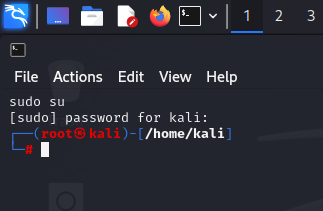
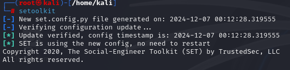
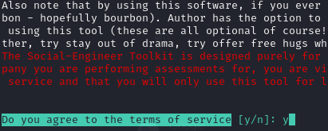
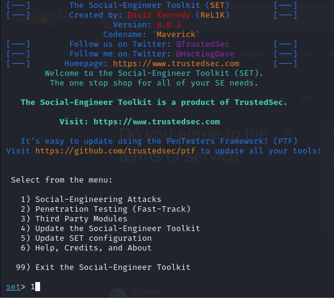
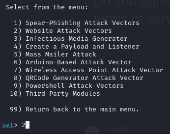
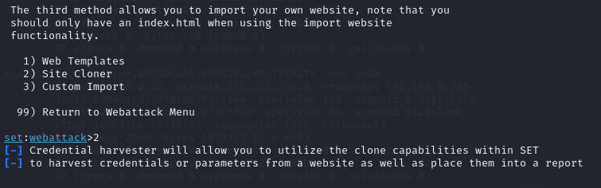
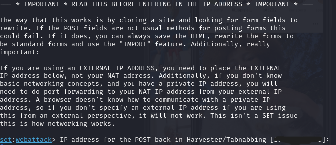
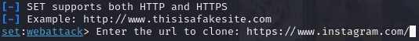
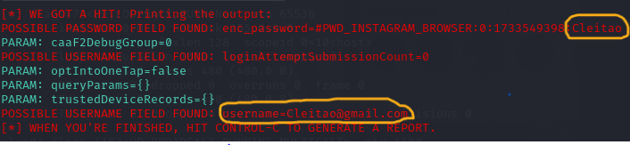

# 🎣 Phishing para captura de senhas do Instagram

### Ferramentas

:white_check_mark: Kali Linux
<br>:white_check_mark: setoolkit

### Configurando o Phishing no Kali Linux
| Descrição      |  Comandos    |
| --- | --- | 
| Acesso root: |``` sudo su ```|
| Iniciando o setoolkit: |``` setoolkit ```|
| Tipo de ataque: |``` Social-Engineering Attacks ```|
| Vetor de ataque: |``` Web Site Attack Vectors ```|
| Método de ataque: |```Credential Harvester Attack Method ```|
| Método de ataque: |``` Site Cloner ```|
| Obtendo o endereço da máquina: |``` ifconfig ```|
| URL para clone: |http://www.facebook.com |


### Passo a Passo 

📌Entre em modo root no terminal digite o comando sudo su e digite a senha.<br>


📌Inicie a ferramenta setoolkit digitando o comando setoolkit<br> 


📌Confirme o termo digitando y<br>


📌No menu escolha a opção Social-Engineering Attacks<br>


📌No proximo menu escolha a opção Web Site Attack Vectors<br>


📌No proximo menu escolha a opção Credential Harvester Attack Method<br>


📌No proximo menu escolha a opção Site Cloner<br>


📌Confirme o IP da maquina caso não queira mudar é só apertar o enter<br>


📌Informe a URL do site que deseja clonar e aperte enter<br>


📌Resultado após o teste<br>


Observação: Para exeutar o teste digite o IP no navegador para abrir a pagina fake.
